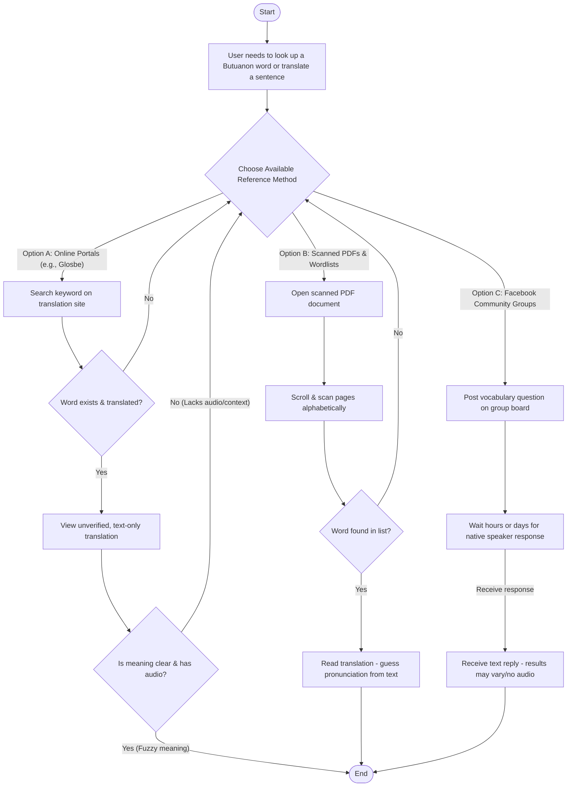
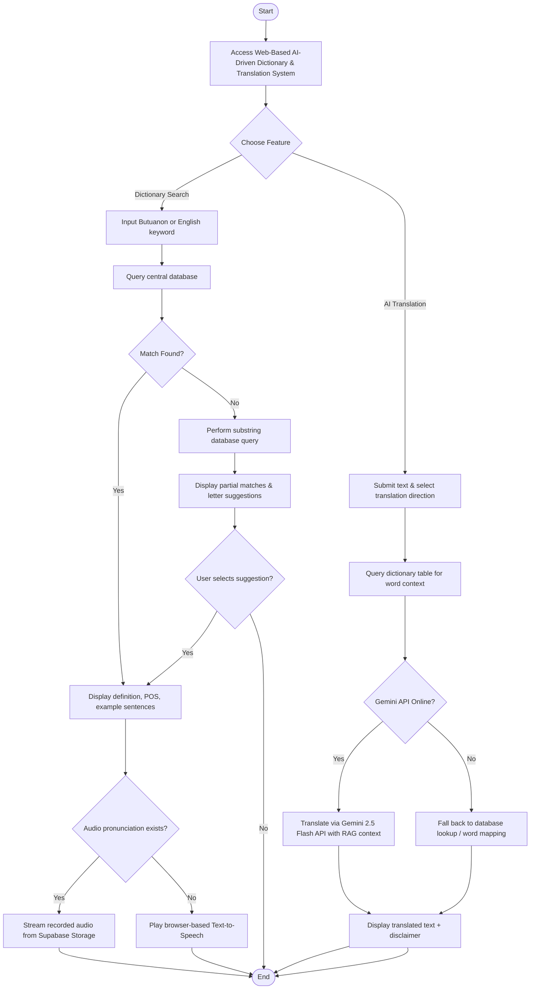
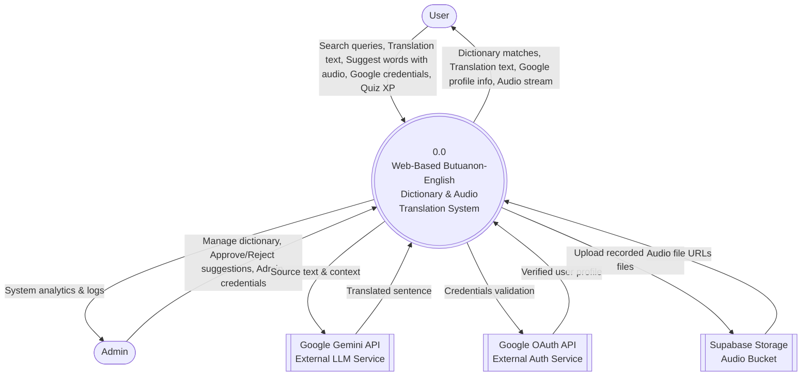
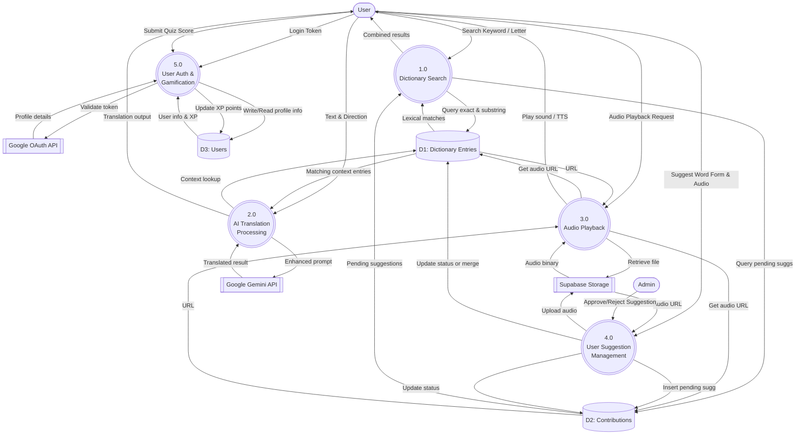
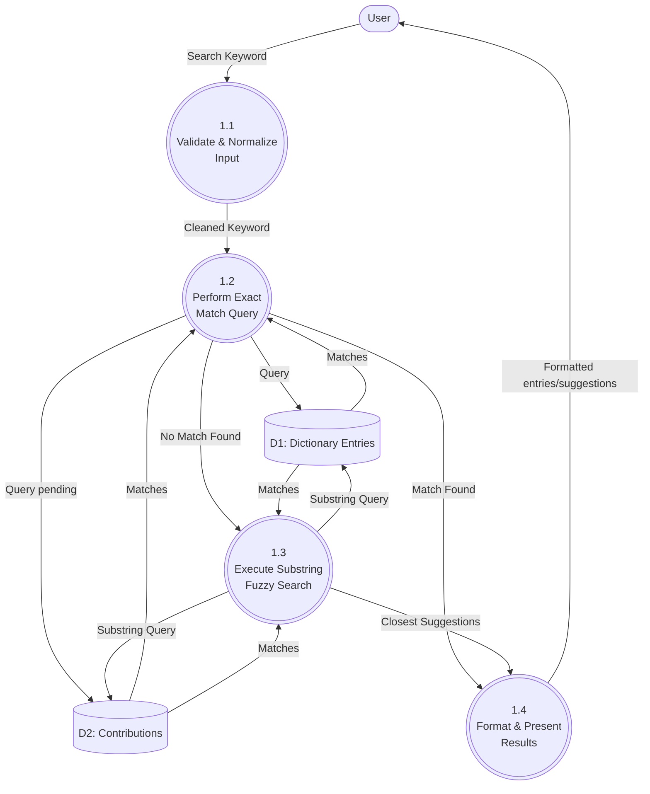
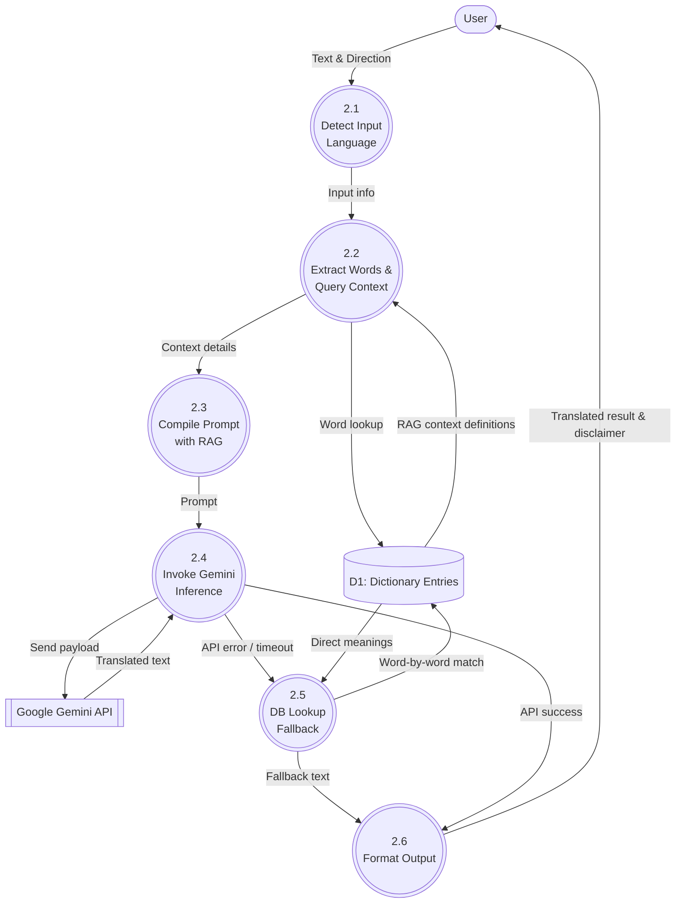
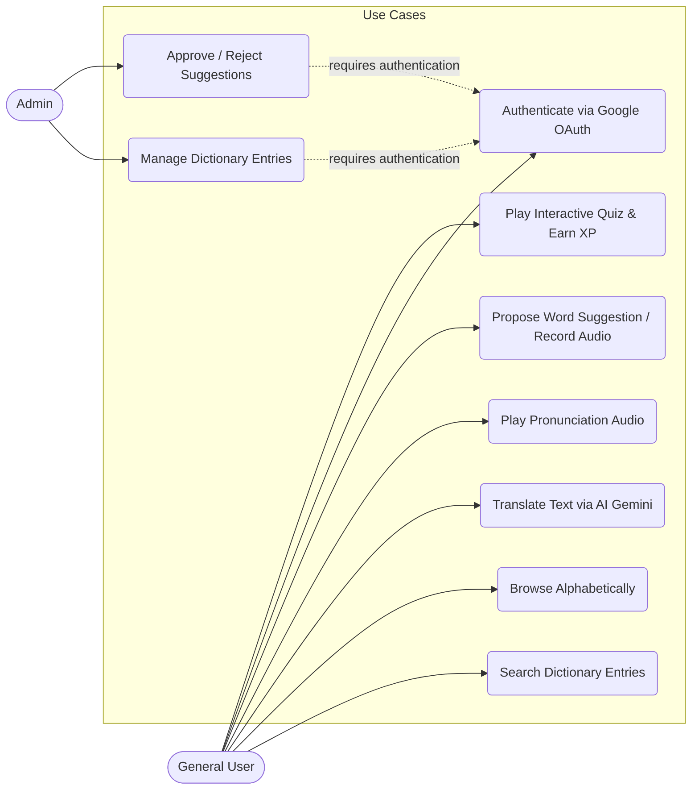
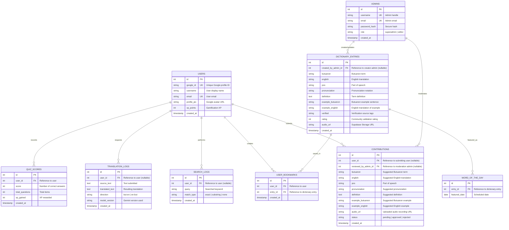

# System Design Documentation
## Web-Based AI-Driven Butuanon-English Dictionary and Audio Translation System

---

## 1. Introduction & Background

### Flowchart (Existing System / Scattered Processes)

Currently, individuals seeking to learn or verify Butuanon words and their English equivalents must navigate scattered, inconsistent, and largely manual resources. Because there is no centralized, dedicated dictionary platform for Butuanon, users typically attempt three primary avenues:
1. **Generic Multilingual Translation Sites (e.g., Glosbe)**: These platforms feature small, user-contributed, and unverified word pairs. They often contain high error rates (confusing Butuanon with other Bisayan languages), lack native-speaker audio pronunciations, and cannot translate full contextual sentences.
2. **Static/Scanned Reference Files (e.g., "Save Our Butuanon Language" PDFs)**: Local educators and linguists have compiled physical and PDF wordlists. However, these documents are not searchable via natural language queries, require tedious alphabetical scanning, lack audio recordings, and do not provide grammatical breakdowns or sentence translations.
3. **Social Media Communities (e.g., Facebook Pages)**: Learners post text-based queries on community boards and wait hours or days for responses from native speakers. The answers are often inconsistent, text-only, and unarchived, meaning the same questions are asked repeatedly.

#### Existing System Flowchart

*Figure 1. Flowchart of the existing system and scattered processes for looking up Butuanon words.*

---

## 2. Proposed System Overview

### Flowchart (Proposed System)

The proposed Web-Based AI-Driven Butuanon-English Dictionary and Audio Translation System addresses these gaps by providing a centralized, searchable, and freely accessible online platform. Users can search for Butuanon or English words directly through the Dictionary module, which returns definitions, parts of speech, and example sentences instantly from a structured database. 

For words or phrases not yet catalogued, or for full sentence translation, users can use the Translation module, which is powered by **Google Gemini 2.5 Flash** integrated with a **Retrieval-Augmented Generation (RAG)** system that injects lexicographical context from the dictionary database. If the API key is not configured or an API error occurs, the system falls back on a deterministic database dictionary lookup and word-by-word mapping.

Every entry and translation result is paired with an Audio feature: if a recorded pronunciation is available on Supabase Storage, it is streamed; otherwise, the system dynamically generates speech using browser-based text-to-speech (TTS) mapped to a regional voice. Users can also register and authenticate via Google OAuth to earn Experience Points (XP) by participating in interactive vocabulary quizzes, and suggest new words by recording audios in their browser.

#### Proposed System Process Flow

*Figure 2. Flowchart of the proposed Butuanon-English AI Dictionary and Audio Translation System.*

---

## 3. Data Flow Diagrams (DFD)

### Data Flow Diagram (DFD) Architecture

The Data Flow Diagram illustrates how data moves within the proposed system. The system involves two primary external entities: the **User** (students, educators, or community members accessing the dictionary, submitting suggestions, and taking quizzes) and the **Admin** (the research team responsible for managing dictionary content and review of community contributions).

Authentication is handled via Google OAuth API, audio assets are hosted on Supabase Storage, and the RAG-based translation is handled by the Google Gemini API.

### Level 0 — Context Diagram

The Context Diagram defines the system boundary, showing the high-level inputs and outputs between the core system and external entities.

*Figure 3. Level 0 Context Diagram of the proposed system.*

---

### Level 1 — Main Processes

The Level 1 diagram breaks the system down into five major processes:
1. **(1.0) Dictionary Search**: Querying the database for exact matches, substring matches, or filtering alphabetically.
2. **(2.0) AI Translation Processing (RAG + Gemini)**: Fetching word mapping context from the database and using Gemini 2.5 Flash API (with DB fallback).
3. **(3.0) Audio Playback**: Retrieving the audio URL from database records and streaming from Supabase Storage (or fallback to client-side TTS).
4. **(4.0) User Suggestion Management**: Submitting community proposals (Word Suggestion) and allowing Admins to moderate contributions.
5. **(5.0) User Authentication & Gamification**: Managing logins via Google OAuth and updating user XP metrics based on quiz scores.

*Figure 4. Level 1 Data Flow Diagram showing the main processes of the system.*

---

### Level 2 — Process 1: Dictionary Search

The Dictionary Search process queries the database entries. The system queries the `dictionary` (and pending `contributions`) table for exact string matches. If none is found, it performs substring query matching in both English and Butuanon. If the server is offline, the client frontend falls back to parsing stored contributions and static dictionary entries in local storage.

*Figure 5. Level 2 Data Flow Diagram for Process 1 — Dictionary Search.*

---

### Level 2 — Process 2: AI Translation Processing

When translating a sentence, the system queries the `dictionary` table for any words matching substrings in the request to construct RAG context. The prompt is sent to Gemini 2.5 Flash, which returns the translated sentence. If the Gemini service is unavailable, the system falls back to a database dictionary mapping engine (matching exact, substring, or splitting word-by-word).

*Figure 6. Level 2 Data Flow Diagram for Process 2 — AI Translation Processing.*

---

## 4. Use Case Diagram

The Use Case Diagram presents the interactions between users and the proposed system.

* **The General User** (students, educators, or community members) can search for entries, filter by alphabet, translate text using the AI translation feature, play audio pronunciations (streams or TTS), and submit suggestions (with recorded pronunciation audio) without logging in. Upon logging in via Google OAuth, they can participate in interactive quizzes and earn XP points.
* **The Admin** (research team), once authenticated, can manage dictionary entries (add, edit, delete) and review/moderate community contributions (approving or rejecting pending suggestions).

*Figure 7. Use Case Diagram of the proposed system.*

---

## 5. Database Schema & Entity Relationship Diagram (ERD)

The database schema utilizes PostgreSQL (via Supabase) to support the complete production feature set of the startup, modeling user access, lexical records, community moderation, usage logging, gamification, and personalization elements.

### Entity Descriptions

| Entity | Purpose | SQL Table Name |
| :--- | :--- | :--- |
| **USERS** | Holds account profiles authenticated via Google OAuth. Tracks gamified user statistics (`xp_points`). | `users` |
| **ADMINS** | Administrative accounts for the research team/editors. Used to manage dictionary content and review community contributions. | `admins` |
| **DICTIONARY_ENTRIES** | Central verified vocabulary listings containing terms, pronunciation keys, definitions, example sentences, verification metadata, ratings, and audio storage URLs. | `dictionary` |
| **CONTRIBUTIONS** | Lexical suggestions submitted by community members. Holds the pending audio recording link, moderation status, and auditing links to administrators. | `contributions` |
| **SEARCH_LOGS** | Tracks query search keywords, helping administrators evaluate search analytics and locate missing vocabularies. | `search_logs` |
| **TRANSLATION_LOGS** | Pairs of texts submitted and translated by the AI model, useful for evaluation and model fine-tuning loops. | `translation_logs` |
| **WORD_OF_THE_DAY** | Featured words scheduled by date, presented on the platform landing page to increase daily learner engagement. | `word_of_the_day` |
| **QUIZ_SCORES** | Records of quiz scores (items got correct vs total) for gamification analytics and XP validation. | `quiz_scores` |
| **USER_BOOKMARKS** | User-specific study lists matching users to saved dictionary entries. | `user_bookmarks` |

### Key Relationships Summary

* **Users to Contributions**: `1:N` cardinality. A logged-in user can submit multiple suggestions/contributions (`user_id`).
* **Users to Activity Logs**: `1:N` cardinality. A user logs multiple search logs (`user_id`) and translation logs (`user_id`) (nullable fields for guest users).
* **Users to Gamification/Personalization**: `1:N` cardinality. Users record multiple quiz scores (`quiz_scores`) and save multiple terms (`user_bookmarks`).
* **Admins to Dictionary Entries**: `1:N` cardinality. An administrator can add or modify multiple dictionary entries (`created_by_admin_id`).
* **Admins to Contributions**: `1:N` cardinality. An administrator reviews, approves, or rejects pending suggestions (`reviewed_by_admin_id`).
* **Dictionary Entries to System Features**: `1:N` cardinality. Entries can be featured as the Word of the Day on multiple dates (`entry_id`) and bookmarked by multiple users (`entry_id`).

### Entity Relationship Diagram (ERD)

*Figure 8. Entity Relationship Diagram of the proposed system database (PostgreSQL/Supabase).*
